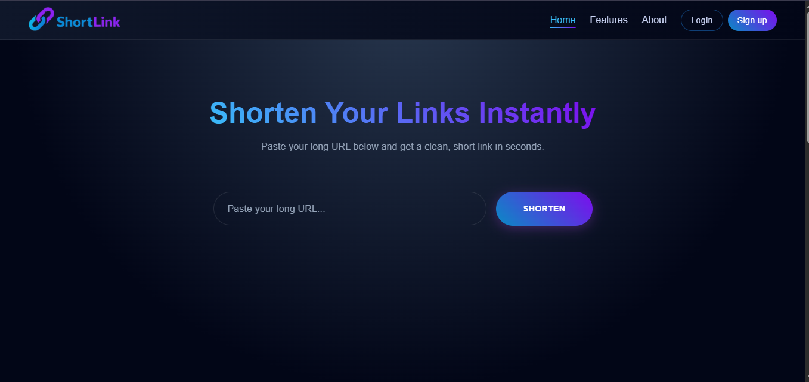
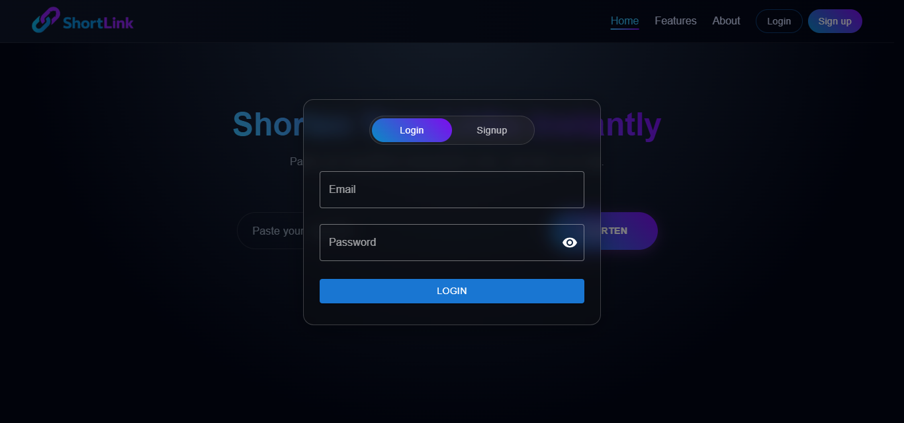
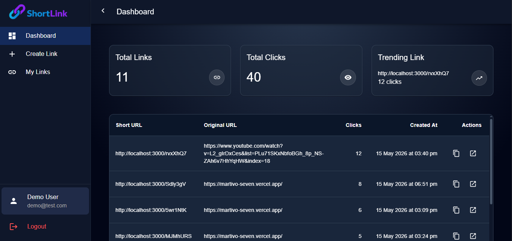
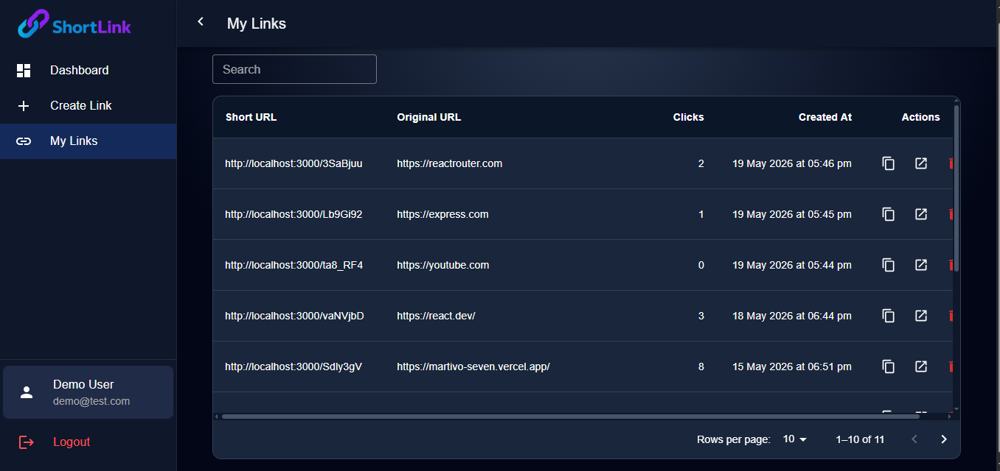

# ShortLink (URL Shortener)

A full-stack URL Shortener application built with the MERN stack. Users can create short links, manage URLs from a dashboard, track clicks, and securely access their account with JWT authentication.

---

# Features

## Authentication

- User Signup & Login
- JWT Authentication
- Protected Routes
- Persistent Login
- Logout Functionality

## URL Management

- Create Short URLs
- Copy Short Links
- Open Original URL
- Delete URLs
- Pagination Support
- URL Expiration Support (Optional)

## Dashboard

- Clean Dashboard UI
- Sidebar Navigation
- Responsive Design
- URL Analytics Table
- Click Tracking

## Frontend Features

- React Context API for State Management
- Material UI (MUI) Components
- Form Validation with React Hook Form
- Toast Notifications
- Loading States
- Reusable Components

## Backend Features

- REST API Architecture
- MongoDB Database
- Express Middleware
- Secure Password Hashing with bcrypt
- JWT Token Verification
- Environment Variable Support

---

# Live Demo

## Live Link

https://shortlink-it.vercel.app/

---

## Demo User

Use the following credentials to explore the application:

- **Email:** demo@test.com
- **Password:** 123456789

---

# Tech Stack

## Frontend

- React.js
- React Router DOM
- Material UI (MUI)
- Axios
- React Hook Form
- Context API

## Backend

- Node.js
- Express.js
- MongoDB
- Mongoose
- JWT Authentication
- bcrypt.js
- dotenv
- cors
- cookie-parser

---

# Screenshots

## Home Page



## Login Page



## Dashboard



## URL Table



---

# Installation

## Clone Repository

```bash
git clone https://github.com/sandeepcodelab/shortlink.git
```

```bash
cd shortlink
```

---

# Backend Setup

```bash
cd server
```

## Install Dependencies

```bash
npm install
```

## Create .env File

```env
PORT=5000
MONGO_URI=your_mongodb_connection_string

CORS_ORIGIN=http://localhost:5173
BASE_URL=http://localhost:5000

NODE_ENV=development

ACCESS_TOKEN_SECRET=long_string
ACCESS_TOKEN_EXPIRY=10m

REFRESH_TOKEN_SECRET=long_string
REFRESH_TOKEN_EXPIRY=7d

```

## Run Backend Server

```bash
npm run dev
```

---

# Frontend Setup

```bash
cd client
```

## Install Dependencies

```bash
npm install
```

## Create .env File

```env
VITE_API_BASE_URL=http://localhost:5000/
```

## Run Frontend

```bash
npm run dev
```

---
